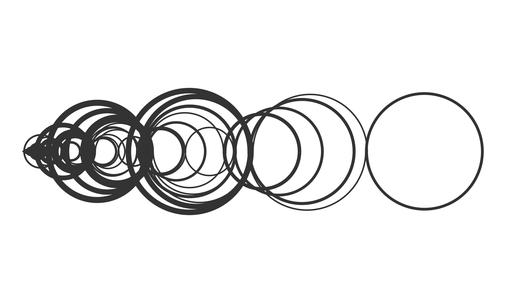

```{r setup, include=FALSE}
knitr::opts_chunk$set(echo = TRUE)
```

# The Recaman sequence

In `recaman-sequence.R` you will find the code to generate and plot the mysterious [Recaman sequence]("https://oeis.org/A005132").




For more details check my blog post.

## Prerequisites

The R code makes use of the `tidyverse` package.
```{r, eval = FALSE}
install.packages("tidyverse")
```

