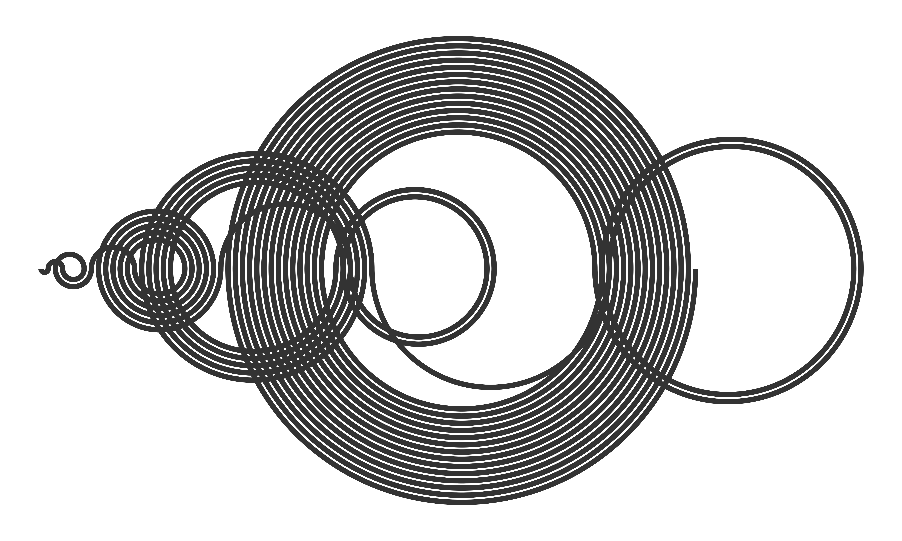

The Recaman sequence
====================

In `recaman-sequence.R` you will find the code to generate and plot the mysterious [Recaman sequence](%22https://oeis.org/A005132%22).



For more details check my blog post.

Prerequisites
-------------

The R code makes use of the `tidyverse` package.

``` r
install.packages("tidyverse")
```
